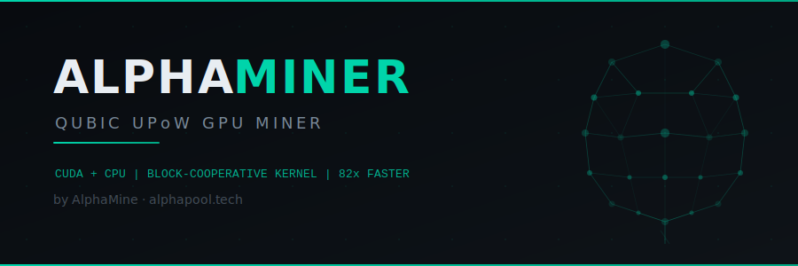
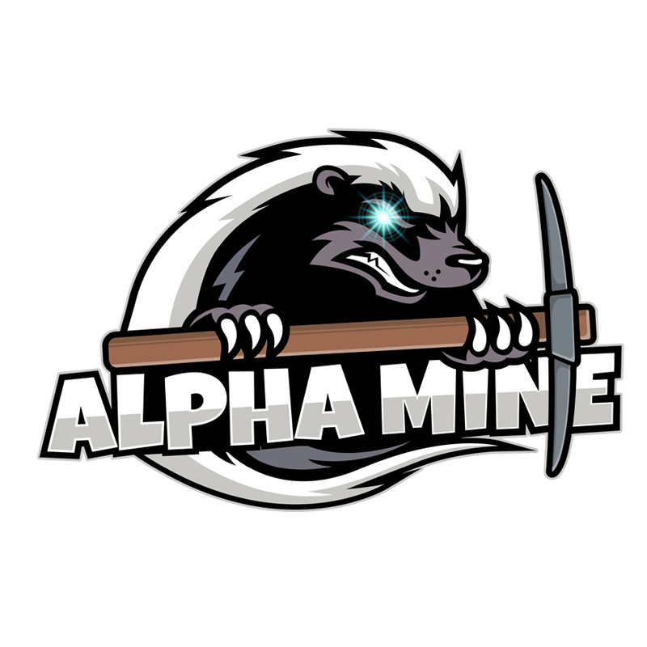
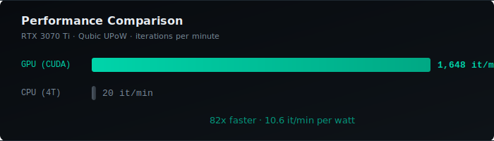
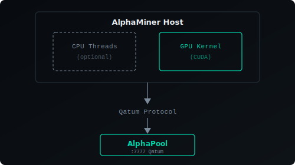

  

  

  <strong>High-performance Qubic UPoW miner with CUDA GPU acceleration</strong>

  
  
  
  

---

## Overview

AlphaMiner is a **proprietary Qubic UPoW (Useful Proof of Work) miner** built for maximum performance and power efficiency. It trains artificial neural networks as proof of work using a custom **block-cooperative CUDA kernel** that achieves **82x speedup** over CPU mining.

> AlphaMiner source is intended to remain private. Public distribution should happen through release binaries and manifests, not by exposing the proprietary codebase. See `RELEASE-STRATEGY.md`.

  

### Key Features

- **CUDA GPU Mining** — Block-cooperative kernel: 256 threads cooperate per nonce via shared memory
- **CPU Mining** — AVX2/AVX512 optimized for AMD EPYC and Intel Xeon
- **Hybrid Mode** — Run CPU + GPU simultaneously for maximum throughput
- **Power Efficient** — 10.6 it/min per watt on RTX 3070 Ti
- **Qatum Protocol** — Native pool communication with auto-reconnect
- **Zero-Skip Optimization** — Skips zero-weight synapses and zero-value neurons

---

## Requirements

| Component | Minimum | Recommended |
|-----------|---------|-------------|
| **GPU** | CUDA Compute 5.0+ | RTX 3070 Ti / RTX 4090 |
| **CPU** | AVX2 | AVX512 (EPYC/Xeon) |
| **VRAM** | 2 GB | 4+ GB |
| **OS** | Linux (Ubuntu 22.04+) | Linux |
| **CUDA** | 11.8+ | 12.0+ |

---

## Install (HiveOS)

This repository is the **public distribution channel** for AlphaMiner binaries and deployment manifests.

Use this installation URL in HiveOS custom miner:

`https://github.com/AlphaMine-Tech/AlphaMiner/releases/download/v1.0/alphaminer-hiveos-gpu-v1.0.tar.gz`

Flight sheet mapping is documented in `packages/hiveos/README-hiveos.md`.

---

## Usage

Run via HiveOS Custom Miner. Manual launch remains available in release package scripts.

---

## GPU Tuning

Optimal nonce count depends on your GPU. More nonces = more parallelism, but diminishing returns past a point. Benchmarks on RTX 3070 Ti (48 SMs):

| Nonces | it/min | VRAM | Efficiency |
|--------|--------|------|------------|
| 96 | 1,009 | ~110 MB | 6.5 it/min/W |
| 512 | 1,492 | ~800 MB | 9.6 it/min/W |
| 1024 | 1,562 | 1.0 GB | 10.1 it/min/W |
| **2048** | **1,648** | **1.4 GB** | **10.6 it/min/W** |
| 4096 | 1,672 | 2.1 GB | 10.7 it/min/W |

**Rule of thumb:** Start with `SM_count * 40` nonces, adjust up until VRAM is ~50% utilized.

---

## Architecture

  

### CUDA Kernel Design

Each nonce is processed by **one CUDA block (256 threads)** cooperating on ANN training:

1. **Thread 0** handles serial operations (init, mutate, insert/remove neurons)
2. **All 256 threads** cooperate on `processTick()` — the hot path (99.7% of runtime)
3. **Shared memory** holds the neuron value buffer (~3KB) for fast atomic accumulation
4. **Cooperative memcpy** for 164KB ANN struct copies across all threads

---

---

  Built by <a href="https://alphapool.tech">AlphaMine</a> — Honey badger don't care.

